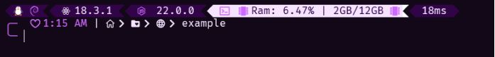
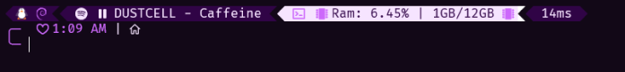

<p align="center">
    
    <h1 align="center">Pinku Oh My Posh Theme</h1>
</p>

Pinku has [folder paths for developers](#folders), support for Spotify and many [technologies](#supports) and an attractive and eye-catching design.

## Installation

> there is currently no installer for windows, but you can follow [this guide](https://configs.igarrux.com/oh-my-posh#windows) for windows installation


Bash or zsh on WSL, Linux and Mac
```bash
curl -fsSL https://pinku.igarrux.com/install.sh | bash
```

Fish on WSL, Linux and Mac
```fish
curl -fsSL https://pinku.igarrux.com/install.fish | bash
```

After installation, follow the guide below to configure the icon fonts 

[Linux Guide](https://configs.igarrux.com/terminal-font#linux)   
[Windows Guide](https://configs.igarrux.com/terminal-font#windows)


Does your terminal look too dull? 

Liven it up with Pinku & Oh My Posh   


Are you using node? Here's your version    


Or Reac?    


Or git?   


Or .... Spotify?   



## 😩Ok, it supports so many things that I'd better write them down below. 

## Supports
1. OS
2. Spotify 
3. React
4. Angular
5. PHP
6. Python
7. Ruby
8. Rust
9. Docker
10. Node
11. Shell
12. Go
13. Powershell
14. cmd
15. zsh
16. fish
17. Git
18. WSL

## Folders 


Fish is developer oriented, so there are icons that represent development folders, these must be in a specific location to be displayed. 

In linux, ```~``` refers to your user home directory

| Path           | Icon                                                        |
| -------------- | ----------------------------------------------------------- |
| ~ (user Home)  |             |
| ~/dev          |               |
| ~/dev/Web      |            |
| ~/dev/Backend  |    |
| ~/dev/Npm      |            |
| ~/dev/Terminal |  |
| ~/dev/Android  |    |
| ~/dev/Icons    |          |
| ~/dev/Fonts    |          |
| ~/dev/Github   |        |
| ~/dev/Mac      |              |
| ~/dev/Ios      |              |

If you are using WSL you may want something similar for when you access windows files, just create a symbolic link to your windows home directory called windows_home.

Run the following by changing "YourUser" to your windows user name
```bash
ln -s /mnt/c/Users/YourUser/ ~/windows_home
```

Then just access your windows home via ~/windows_home